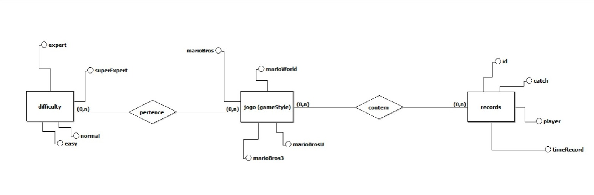
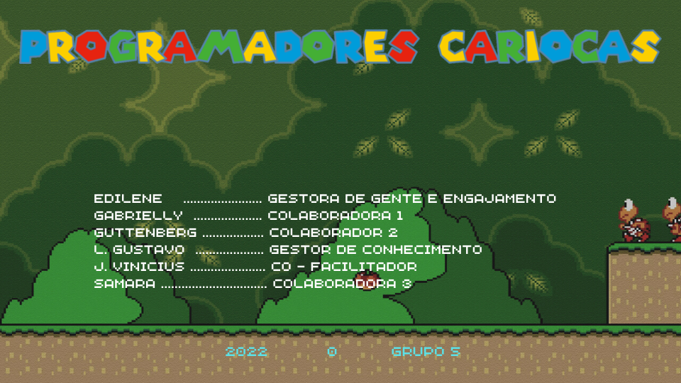

O objetivo deste projeto é a manipular e visualizar os dados inseridos em um banco de dados SQL em uma ferramenta como o MySQL. Assim, o projeto foi dividido em algumas etapas:

🔴 Criação e utilização da tabela:  Utilizamos o XAMPP. Lembrando que os arquivos .CSV foram disponibilizados pela Resilia;
 
🔴 Debate: Onde foram elaboradas perguntas para a execução dos dados das tabelas;

🔴 Organização e utilização de ferramentas como MySQL, Github, Canva e XAMPP para organização e construção do projeto.

TIME: 
🟢 Edilene  - 
🟢 Gabrielly -
🟢 Guttenberg - 
🟢 J. Vinicius -
🟢 L. Gustavo -
🟢 Samara  - 

FERRAMENTAS UTILIZADAS: 
🔴 XAMPP 
🔴 Mysql 
🔴 Canva 
🔴 Excel 
🔴 Github 

PERGUNTAS:

🟢 Qual o estilo do game que foi menos jogado? 
🟢 Qual o estilo do game que foi mais jogado? 
🟢 Qual o nível de dificuldade mais jogado? 
🟢 Qual o nível de dificuldade menos jogado?
🟢 Qual a porcentagem de jogadores que obteve mais de 20.000 pontos?

DASHBOARD 

